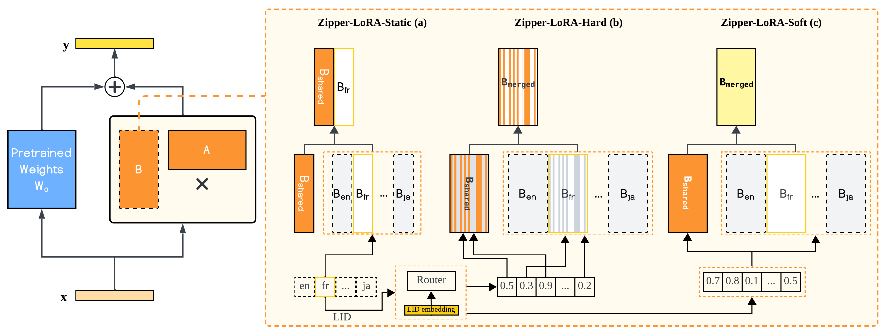

# Zipper-LoRA: Dynamic Parameter Decoupling for Speech-LLM based Multilingual Speech Recognition

[](https://arxiv.org/abs/2603.17558)
[](https://huggingface.co/YuCeong-May/Zipper-LoRA)
[](LICENSE)

## 📝 Abstract

Speech Large Language Models (Speech-LLMs) have emerged as a powerful approach for automatic speech recognition (ASR) by aligning speech encoders with large language models. However, adapting these systems to multilingual settings with imbalanced data distributions remains challenging. In such scenarios, a stability-plasticity dilemma often arises: fully shared Parameter-Efficient Fine-Tuning (PEFT) can cause negative inter-lingual interference for under-represented languages, while fully language-specific tuning limits the cross-lingual beneficial knowledge transfer needed for low-resource tasks. To address this, we propose Zipper-LoRA, a novel rank-level decoupling framework with three variants (Static, Hard, and Soft) that dynamically synthesizes LoRA updates from shared and language-specific subspaces. By using a lightweight language-conditioned router, Zipper-LoRA dynamically controls the contribution of each subspace at the LoRA rank level, enabling fine-grained sharing where languages are compatible and strict decoupling when conflicts occur. To further stabilize optimization under imbalanced data, we propose a two-stage training strategy with an Initial-B warm start that significantly accelerates convergence. Experiments on a 12-language mixed-resource setting show that Zipper-LoRA consistently outperforms both fully shared and independent baselines, particularly in extremely low-resource scenarios. Moreover, we demonstrate that these gains are robust across both chunked and non-chunked encoder configurations, confirming the framework's reliability for practical, large-scale multilingual ASR.



## 📋 TODO

- [x] Paper
- [ ] Code
- [ ] Model Weights (coming soon: https://huggingface.co/YuCeong-May/Zipper-LoRA)


```bibtex
@article{ZipperLoRA2026,
  title={Dynamic Parameter Decoupling for Speech-LLM based Multilingual Speech Recognition},
  author={Mei, Yuxiang and Qiu, Delai and Liu, Shengping and Liang, Jiaen and Long, Yanhua},
  journal={arXiv preprint arXiv:2603.17558},
  year={2026}
}
```

---

**Status**: Under construction 🚧